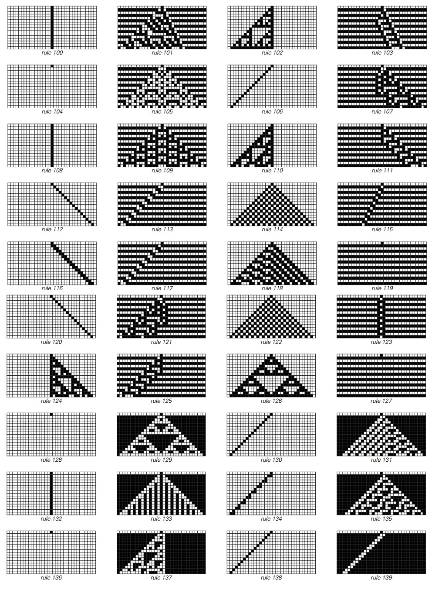
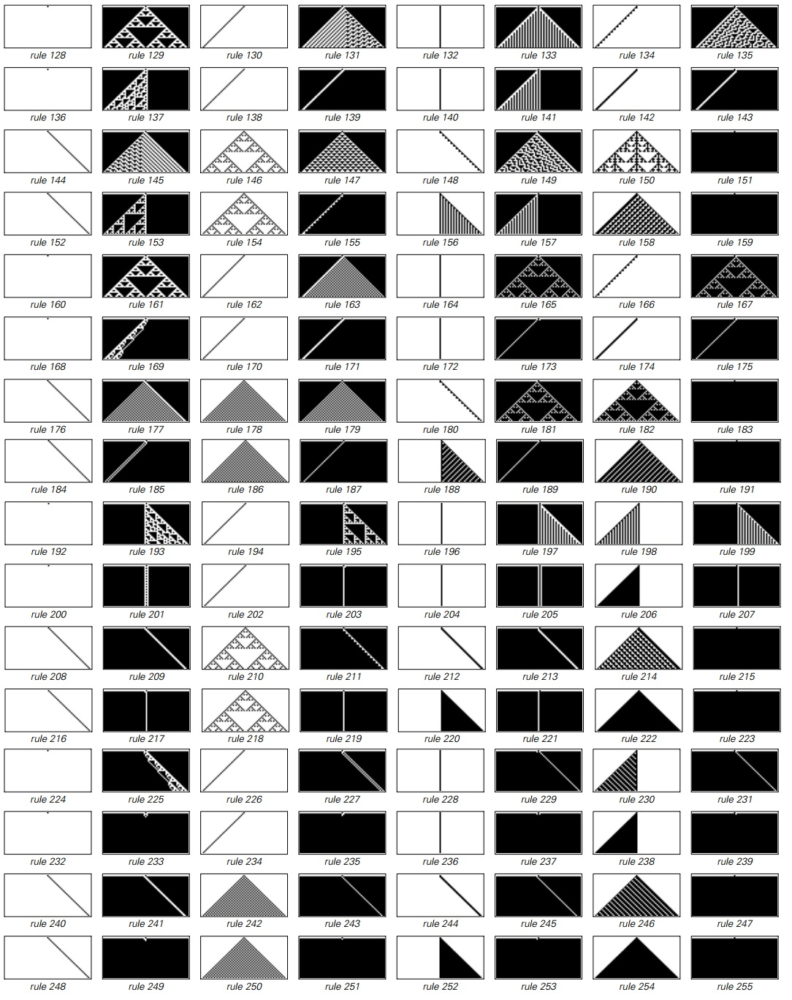
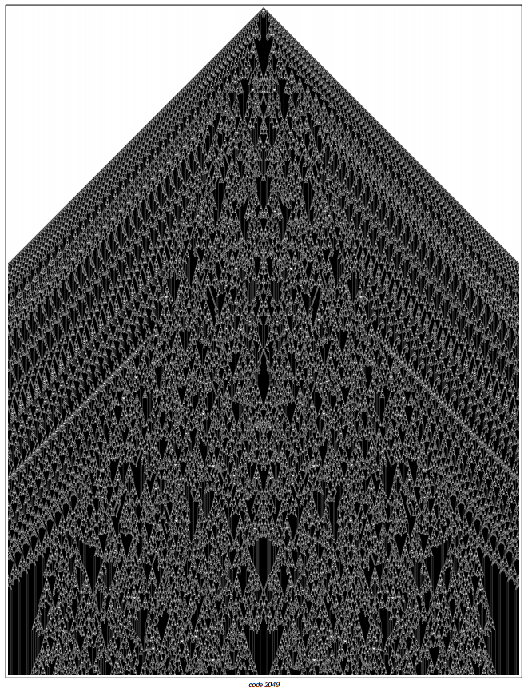
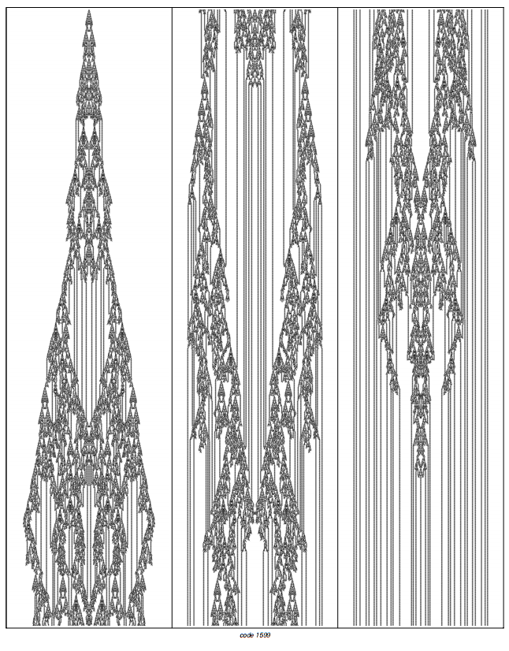
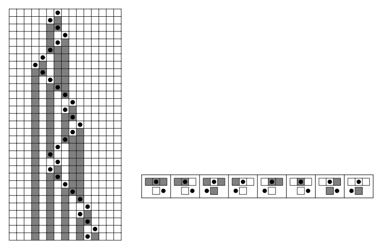
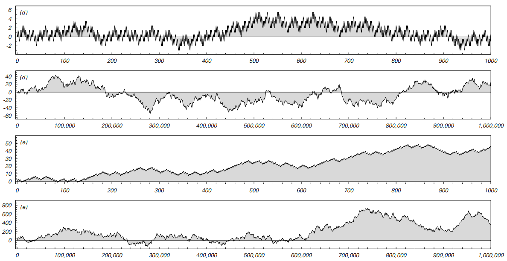
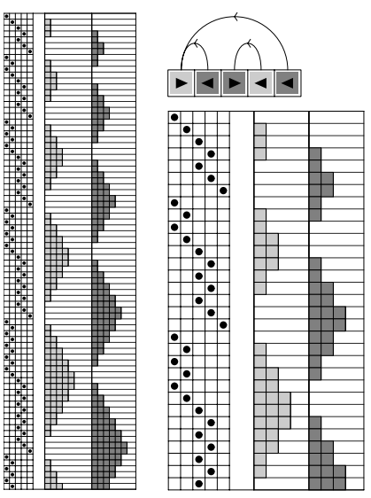
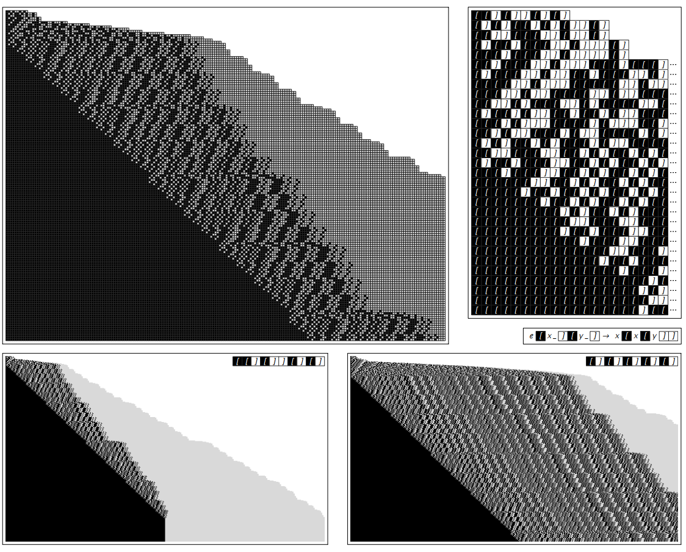

# 第三章 简单程序的世界

### 寻找共性

在上一章开头我们提出了：“简单模型能做什么”的问题。我们举出了一些细胞自动机模型的具体例子作为迈向答案的一步。

我们找到的基本行为类型被呈现在下一页的图片里。在第一张图片里只有简单的重复，只组成了一个很简单的图案。在第二张图片里出现了复杂的细节，但总的来说只出现了很规律的结构。

但是在第三张图片里找不到这样的规律性了，出现了随机的行为。最终在第四张图片里仍然出现了更复杂的行为----产生的复杂结构以复杂的方式相互作用。

在开始没有迹象表明简单的程序可以产生如此不同，如此复杂的行为。但看过这些例子之后，问题变成了“它们有多少代表性？”。只是细胞自动机在特定的规则下会产生这样的行为，还是事实上这种行为广泛存在于所有简单计算模型？

在这一章我的目的就是要通过广泛地考量很多不同的计算模型来回答这个问题。在某种程度上我的方法是像一个自然主义者那样工作-----探索和研究简单计算模型中存在的不同形式。

我开始考虑更一般的细胞自动机，接下来我开始思考一连串其他种类的细胞自动机----使用基本的结构与在前一章中由黑白细胞组成的阵列渐行渐远。

我的发现是：无论使用什么样的基本规则，呈现的结果和我们已经见过的细胞自动机的行为非常相似。

看来，这些基本计算模型产生的行都很有普遍性。在一定程度上最终是这个发现使我建造我在这本书中描述的这门条理清晰的新科学变成可能-------并且用它去阐释很多现象，独立于产生这些现象的系统的细节。

\(p52\)

### 更多的元胞自动机

下面的图片呈现了本书封面四个细胞自动机使用的规则。总体来说每种规则的结构是一样的，不同的是颜色的组合。（每个方框都可以选择两种图案）

结果就有256种不同的组合（2^8=256），编号0~255.
 

但是细胞自动机有了这么多规则会怎么表现呢？下一页显示了一些细节上的例子，再往下面两页呈现了全部的256种可能情况。
 

在一开始，可以看到压倒性的多样性。但是仔细观察，明确的主题出现了。

在一些最简单的例子中，细胞自动机中最后一步所有的细胞和第一步之后的细胞颜色是一样的。

举个例子，规则0和规则128，所有元胞都变为白色，规则255所有都变成黑色。还有规则7和127在黑色白色之间交替。

但是在前几页的大部分规则中，唯一共有的行为是一个由单独元胞或者小团体组成的模式。有时候这个模式保持稳定，就像规则4和123，但有时候，比如2和103，它往左或往右移动。

其实这里讨论的元胞自动机的基本结构意味着其任何移动的最大速度都必须是每步一个元胞。在许多规则下，都达到了最大速度——即使是规则3和103，平均速度也到了每步半个元胞。

在三分之二的元胞自动机中，这些模式保持了固定的尺寸。但在三分之一的例子中，这些模式一直在增长。对这种增长模式，最简单的类型是纯粹的重复，比如规则50和109。但是尽管重复模式都有常见的边缘，仍有大约14%的元胞自动机产生了复杂的模式。

最常见的是嵌套模式，比如下一页将要展示的。事实上尽管24个规则产生了嵌套模式，只发生了三种基本不同的形式。最简单的是最常见的，如规则22和60。但是正如下一页的图片展示的，其他嵌套的模式也有可能。（在规则225的例子中，整个模式的宽度并没有以一个固定的比率提升，而是与步数的平方根成比例。）

（p57）

生成嵌套或者分形图形的例子。规则22——就像26页的规则90——给出了一个分形维度Log\(2,3\)≈1.59的模式；规则159给出了一个分形维度Log\(2,1+√5\)≈1.69的模式。从规则225获得的模式宽度以步数的平方根递增。\r 

重复和嵌套是许多元胞自动机的主题。但当我们看之前的章节，似乎也可能产生一个看上去随机的模式。在讨论的256个规则中，事实上有10种表现出随机性。下页将展出主要的三种基本模式。

（p58）

看上去产生了随机特性的元胞自动机的例子。展示了三百步的演变，均从单个黑色元胞开始。
 

（p59）

除了随机性，上一章最后一个例子，110号自动机，其行为由复杂的规律与不规律的区域混合。这个特别的元胞自动机本质上是独立于256个规则外的：四种情况都能看到，互换左右和黑白都是等价的。

还有更复杂的元胞自动机规则吗？

我们讨论的256个基本规则目前为止都是最简单的情况——也就是我最开始研究的。但如果我们将颜色扩充到三种而不是两种，元胞不再是非黑即白，还有一种灰色。可能的规则数目就会立即膨胀到——762597484987种——但如果只考虑用“极端\(totalistic\)”的情况，就容易管理了。

极端情况规则的想法是将每个新的颜色依赖于其近邻的平均颜色，而不是某个个体的颜色。下面的图片演示了其中一个例子是如何运作的。在三种可能的颜色下，共有2187种可能的极端规则，每一种都能由编码表示。下一页会给出一些代表性的规则。

有三种可能颜色下的极端元胞自动机。规则建立在每个元胞新的颜色是由其近邻的平均颜色决定的。0代表白色，1代表灰色，2代表黑色，最右的规则里每个元素都是0，平均是0，其左边一个规则代表平均颜色是1/3。新颜色的序列可以用一个三位数来表示，可以用这个编码来代表每一个极端规则。
 

（p60）

一系列有三种颜色的极端元胞自动机。尽管它们的基本规则很复杂，元胞自动机在这里展示的相比于两色元胞自动机，并没有太复杂的行为。注意这些序列的规则，改变白色背景的规则没有包含进来。所有模式的对称性是极端模式的基本结构。
 

（p61）

我们可能期望使用3种颜色而不是两种能够得到更为明显和复杂的行为。但事实上，我们在前一页看到的和我们之前的看到的基本元胞自动机有什么不同。有更复杂的规则似乎并没有使得行为更加复杂。

事实上，这是一次重要的通用现象的指示：至少在某个界限点之前，增加系统潜在规则的复杂性并没有使得行为更为复杂。比如说在元胞自动机的例子中，似乎所有产生复杂行为的基本要素已经在基本规则中存在了。

使用复杂的规则可能会便于再现特定自然系统中的细节，但是根本上它没有添加新的特性。其实，通过之前页的图就可以看出基本元胞自动机的主题。有一些能够达到确定大小的模式，然后不断重复，就像下面演示的，不断生长重复的形式，还有下一页的顶部的图，其他图产生了嵌套和分形的模式，在下一页底部。

三色极端规则下产生的能够得到确定大小的模式，且不断重复。最大的重复周期是78步，由1329号规则得到。本页和下页图中的初始条件均为一个灰色元胞。
 

（p62）

三色极端规则下不断增长但有基本的重复结构。
 

三色极端规则下产生嵌套嵌套模式，在大多数例子中，这些模式，有一个通用的与两色相同的模式，但是比如420号规则，产生了略微不同的结构。
 

（p63）

产生近似随机特性的三色极端规则的例子。这里各演示了三百步。
 
（p64）
在细节上，一些模式肯定比那些在基本规则中看到的更复杂。但在整体行为层面上，没有根本的区别。在嵌套模式的情况下，即使是特定结构也通常与基本规则相同。比如，237号和948号的结构是最常见的，其次是1749号。在基本规则中还未见过的新结构是420号，但这只是很少发生。

大约85%的极端规则的元胞自动机产生的行为都是很规律的。但是就跟基本元胞自动机一样，在某些规则上的行为看上去也是随机的。就像上一页给出的一些例子。

除了相当均匀的随机行为外，也有类似于基本规则110的情形，其中确定的结构以复杂的方式相互作用。下一页给出了一些例子。在第一个案例中，该模式在大约150步之后重复出现。然而，在另外两种情况下，不太清楚最终会发生什么。下面的页面将继续这些模式，执行3000步。但即使在这么多步之后，最终的行为将会是什么还不清楚。

看着这些图，第一次开始觉得很难相信它们是有很简单的元胞自动机规则产生的。事实上，即使一个人接受了这一点，仍然有一种倾向，认为某一个人看到的必然是元胞自动机的某些特殊特征的结果。

事实证明，复杂性在元胞自动机中很常见，很幸运的是我第一个决定研究的系统就是它。

但正如我们将要在本章余下内容所看到的一样，我们在前面发现的基本现象并不仅仅是发生在元胞自动机。尽管元胞自动机是很好的例子，但我们会发现，许多不同的系统中会表现出极其相似的行为。

（p65）

三色极端规则中有着规律与不规律混合的行为的例子。分割成的可识别结构与32页110号规则相似。
 
（p66）

（p67）

66页的两个元胞自动机执行3000步后的情况。尽管潜在规则很简陋，最终产生出的模式却很复杂。在这两种情况下，并不清楚最终结果会怎样——是结束随机性，还是产生简单的重复形式。
 

（p68）
下面的图演示了极端规则的元胞自动机的模式增长，在最初十分复杂，但是在一百步之后，四个中的三个的形式变得简单起来。
 

然而接下来的这个模式要复杂的多，下一页会演示，虽然几千步的简单增长都是不规律的，但是增长越来越缓慢。而且内部的模式开始消亡。尽管会有偶然爆发的增长，但是最终，8282步后，模式变为了简单的重复结构。
（p69）

1599号三色元胞自动机九千步的进化。从最开始一个灰色元胞，每一列都有三千步，进化最终在8282步后变得清晰，其模式变成了31个简单重复结构。
 

（p70）
### 移动自动机
元胞自动机的一个基本特征就是所有元胞包含的颜色每一步都是并行更新的。

但这个特征在决定整个将发生的行为中有多重要呢？为了解决这个问题，在这一部分我考虑了一类系统，称之为“移动自动机”(mobile automata)

移动自动机和元胞自动机相似，除了不再是并行更新。它们有一个独立的“活跃元胞”在每一步进行更新，并且有一个规则来指定这个活跃元胞在下一步如何移动。

下面的图展示了一个移动自动机的例子，活跃元胞由一个黑色点表示。这个规则仅对活跃元胞应用，它关注活跃元胞所在位置以及其近邻的颜色，然后对当前元胞新的颜色做出指示，以及活跃元胞往左还是往右移动。

一个移动自动机的例子。就像元胞自动机，一个移动自动机由一行元胞组成，每一个有两种可能的颜色。但和元胞自动机不同的是，移动自动机在每一步有一个活跃元胞（黑色圆点）。移动自动机的规则指示了活跃元胞如何更新，以及该向左还是向右移动。在大量步数运行后的结果见下页。
 

对元胞自动机我们能枚举出可能的所有规则种数，一共有65536种。下一页顶部的图片演示了这些规则的典型行为。在(a)和(b)中，活跃元胞约束在一个小区域中，其行为是简单重复的。(c)和(f)是类似的，整个模式向右移动，在(e),(f)中，整个往左移动。
（p71）

移动自动机的几个规则示例。在a和f中活跃元胞纯粹是重复的，在g和h中则不是，模式的宽度在t步的增长近似为√2t。
 

但在整个65536中的218种，我们能得到不同的行为。就像下面(g)和(h)所示。活跃元胞并不是严格重复的，而是前后扫的，每次扫得更宽。

虽然，整个模式的产生依旧很简单。而且事实上在下面的压缩表格中，它是纯粹重复的。

 g和h的压缩版，如果只显示最左或最右的活跃元胞得到的。
 

在65536种可能的元胞自动机中，目前为止没有一个显示出更复杂的行为。那么下面这种行为也会发生在其中吗？

我们可以扩展规则，不再是活跃元胞本身的颜色，也包括其近邻都在每一步更新经过这种扩展，一共得到4294967296种可能的规则。

如果对这些规则进行随机取样，我们能发现99%的都产生了简单重复的行为。但是在少数一千种规则中，我们能看到类似下面的行为：不是纯粹的重复，而是一种嵌套的结构。

一种产生了嵌套模式的有着更加复杂规则的移动自动机。图中每一列演示了200步的进化。压缩形式的模式基于一共8000步。
 
（p73）

尽管如此，整个模式还是很规则。但我们会发现下面的规则在50000步后，其压缩模式展示出一种类似完全随机的现象，就像规则30。

一种产生看上去随机特性的移动自动机。活跃元胞的移动是相当规律的，就像图中所示。整个模式的颜色看上去在很多方面都是随机的。每一列展示出200步的进化，压缩模式演示了50000步。
 

但即使上图中活跃元胞最后剩下的模式看上去是随机的，活跃元胞本身还是规律的。所以存在一种移动自动机其活跃元胞是随机的吗？一开始我觉得可能没有，但在数百万规则中寻找后，最终我发现了下页这个例子。

（p74）

一种移动自动机，其活跃元胞的位置是一种近似随机的方式。每一列有400步，压缩模式显示了50000步。为了找到这种复杂行为的自动机找了数百万种。
 

（p75）

尽管实际上移动自动机每一步只更新一个元胞，但是其行为依然产生了相当的复杂性。但我们发现这种行为虽然在元胞自动机中十分常见，却在移动自动机中十分少见。

我们可以通过研究一类广义移动自动机来了解这种差异的起源，感觉上这种广义自动机介于一般的移动自动机和元胞自动机之间。

这种泛化的移动自动机的基本想法是允许不止一个元胞在每一步进行活动。潜在的规则是在特定的环境下，一个活跃元胞能够分裂成两个，或是完全消失。

例如下面的图片，每隔几步就会产生新的元胞。

一种泛化的移动自动机，每一步有任意个活跃元胞。上面的规则应用到每个活跃元胞的特定一步。在许多情况下，规则明确规定活跃元胞应该向左或是向右。但是在一些情况下，它会分裂成两个，因此增加了活跃元胞数量。
 

如果我们随机选择泛化的移动自动机，大多数还是会产生简单行为，就像下一页演示的那样。但是在一小部分情况中，行为更为复杂了。一般活跃元胞是规律的，但有时不是。

看更多的例子，一个确定的主题浮现：复杂行为大多数情况不能发生，除非同时有大量的活跃元胞。事实上，这意味着整体的活动和复杂行为的可能性具有显著的相关性。这就是为什么复杂行为在元胞自动机中比移动自动机更为常见。

（p76）

泛化移动自动机的例子。情况a中，只有有限个元胞活跃，但是在其他情况中活跃元胞不断扩散。d中，所有元胞都是活跃的，系统基本上就像元胞自动机。剩下的几种，有些复杂模式的元胞是活跃的。注意不像一般的移动自动机，这些复杂行为的例子是相对容易找到的。
 

（p77）
### 图灵机

在计算的历史上，曾构造的最早广为人知的理论程序基于一类被称作图灵机的系统。

图灵机和移动自动机类似，它们都由一条元胞组成，即“磁带”，有一个活跃元胞，即“磁头”。但是和移动自动机不一样的是，图灵机的头可以有许多种可能的状态，就像下图，有许多种可能的方向。

此外，图灵机的规则可取决于磁头的状态，以及磁头处元胞的颜色，但与近邻元胞的颜色无关。

一个图灵机的例子，就像一个移动自动机，图灵机的活跃元胞是一个磁头，但是这个头有许多种可能的状态，就像这幅图中箭头指示的几个方向。
 

图灵机至今仍广泛用于理论计算科学中。但是在几乎所有的情况中，我们都能想象得到，构建出能完成特定的任务的例子，需要通过大量可能的状态以及可能的元胞颜色数量。

实际上，有一种非平凡的图灵机，有两种可能的状态以及两种可能的元胞颜色。下一页演示的4096号就是这类。虽然没有更复杂的情况，重复和嵌套的行为都能看到发生。

（p78）

一个有两种磁头状态的图灵机的例子，共有4096种可能规则。这里只能看到重复嵌套的模式，没有更复杂的情况发生。

 

有了我们在移动自动机的经历，我们可能期望存在图灵机能够有更复杂的行为。

三种状态的磁头下，大概有三百万种可能的图灵机。但这些中的部分行为似乎在细节上更为复杂，就像下一页的案例a和b，但最终都产生了重复嵌套的模式——至少是从所有元胞为白色开始。

四种状态下，更加复杂的行为立即变得可能。事实上，大概一百万规则里有五种都产生了近似随机模式的特征，就像下下页展示的那样。

如果允许磁头超过四种状态会发生什么？结果是几乎没有什么行为上的变化。表面上的随机变得更为寻常，但除此之外结果都是一样的。

我们再一次看到了似乎存在一个复杂行为的界限——在四种状态就达到了。就像元胞自动机里，添加更复杂的潜在规则，而最终不会产生更复杂的行为一样。

（p79）

三种和四种状态下的图灵机。在三种可能状态时，至少在全白色元胞开始时，最终都只有重复和嵌套的模式。最上面的一组图演示了不同规则下150步的进化，均从同一个状态开始（箭头向上），所有元胞均为白色。最下面的一组图是压缩形式，每张图包含了50步磁头达到当前最左或最右的情况。

（p80）

一个在各种意义上展示出随机行为的图灵机。这个图灵机有四种可能的磁头状态，每条磁带上的元胞有两种可能的颜色，以黑白表示。每一列有演示了250步的进化。下面的压缩形式一共演示了20000步。
 
（p81）

### 替换系统

元胞自动机、移动自动机和图灵机所共有的最重要的一个特征是在最底层由一系列固定的元胞组成。这意味着当无论这些元胞的颜色通过多大范围不同的规则更新，潜在的元胞数量和组织都保持不变。

然而，替换系统设置的元素的数量是可变的。一个典型的案例如下，它含有一系列的元素——每一个是白色或者黑色——每一步将之前的元素替代为新的元素块。

简单的例子中，规则表示着每个特定颜色的元素应该被固定的几个元素块所替代，并且独立于其近邻的颜色。

替换系统的例子。这个系统有两种可能的元素，每一步都被固定的新元素块所替代。第一次演示这个案例时，元素的总数在每一步翻倍，它遵循斐波那契数列，每一步的增长因子大概是(1+√5)/2≈1.618。这里演示的两种增长系统和下一页第三第四个例子相符合。

由于这类规则，元素总数增长地相当快，所以图片很快变得相当笨重。但至少对于这类规则，我们可以考虑每一步的替换元素的尺寸不再相同，而是用更小的尺寸。

在下一页，从开始的一个简单的元素用一个长条形表示，然后每一步替换规则指定这个长条如何被划分得更短。

（p82）

替换系统的例子，每一步的元素都被划分成新元素。在所有情况中，得到的整个模式能够看出一种非常规则的嵌套形式。规则b给出了所谓的Thue-Morse序列，我们会遇到很多次。c和斐波那契数列相关。d给出了一个康托尔集的版本。

下一页顶部的图演示了一些例子。我们能看到的就是模式产生的明显的规律性。如果仔细看，会发现每个模式由一系列相同嵌套的碎片组成。

最终结果并不意外。毕竟，替换系统的基本规则规定任何时候相同元素颜色出现时，都会以同样的方式被划分。

嵌套结构不用长条表示，而是用树枝的形式表示的话会更清晰。根据这个想法，从树干开始，应用替换系统，每一次决定每个树枝如何划分成更小的树枝。
（p83）

更多的替换系统的例子。每一个规则产生不同的序列元素，但最终都变成了简单的嵌套形式。

关键是因为规则只依赖于特定树枝的颜色，而不是临近树枝的颜色，从树枝生成的子树必须有相同的结构，就像下图所示。

前一页的替换系统的演进，但用树的形式演示。从最底部的树干开始，规则规定每一步的树干颜色应该以同样的方式划分成更小的树枝。结果是每棵树都由更小的相同结构的子树组成。在400页我们会用相似的系统讨论实际的树和树叶。

（p84）

要得到比嵌套模式更复杂的行为，我们要考虑让替换系统的规则不只依赖于单个元素的颜色，而至少包含一个其近邻的颜色。下面的图演示例子的规则，替代规则不仅依赖其本身颜色，也包括其右侧的元素颜色。

一个颜色依赖自身颜色和右近邻颜色的替代系统。这种规则不能简单地当做是对元素的划分，在图中没有明显的长条尺寸用来选择。我这里做的是在每一步简单地平均划分。注意每一步的最右元素都是不变的，因为没有规则说如何替代它。

在第一个例子中，获得的模式是嵌套结构。但是在第二个例子中，行为更加复杂了，没有明显的嵌套结构。

然而两个例子的一个共同特点是元素的总数从未减少。原因是我们指定的基本规则是每一个元素都至少会被一个新元素替代。

（p85）

当然，也可以考虑一种元素能够消失的替代系统。如果这种消失率太高，任何模式都会快速消亡。如果消失率太低，模式就会快速增长。

但也有一小部分规则元素的创造和析构相当平衡。

两种同时破坏和创造的替代系统。左边采用的是比例变化，整体尺寸保持一致。右边是让每个元素保持固定尺寸，就像82页的图一样。右边元素的破坏创造相当平衡，每一步只增长一个固定的数量。

上图演示了两个例子。元素的数量在不断增加，但是每一步都是固定的数目。在这种缓慢的增长下，我们在此将每个元素用一个固定尺寸的格子代替，就像82页一样。

当我们以这种形式查看时，替代系统展示的模式是简单重复的形式。结果表明，在相同类型的的替代系统中，所有增长缓慢的系统只能产生这种简单重复的模式。

知道这个后，我们可能会总结认为替代系统不能产生像元胞自动机那样的复杂性。但就像移动自动机和图灵机那样，我们再次想错了。事实上，就像下面的图演示的，允许三到四种颜色立即显示出了复杂的行为。

（p86）

每种元素有三到四种可能颜色的替代系统。这些特定规则是使得元素总数缓慢增长的。注意每一行的图，只有元素的序列是很重要的，像图中，一个特定元素在当增加或者消去一个元素时可能会改变其位置。注意a中的模式是重复的，b是一种嵌套结构。

（p87）

结果，第一个替代系统工作得完全像一个元胞自动机。其实，从右边缘看，所有的元素都像在一个正常的网格上，每一个元素的颜色取决于前一个和右边的颜色。

第二个替代系统再次拥有表现出正常网格状的补丁。但在这些补丁之间，有部分区域在销毁和重建。在其他替代系统所示的中，元素始终在销毁重建，没有留下任何简单的网格结构。所以我们最后得到的看起来就像元胞自动机一样的随机。

### 有序替代系统

我们目前讨论的系统都看起来不像我们平时用的程序。但接下来的一个替代系统的变形的例子，基本上就像一个文本编辑器。

理解这种相似一致性的第一步是要将替代系统中对元素序列里颜色的操作考虑成对字符串中字符的操作。比如说，替代系统某一步的字符串为ABBBABA，A代表白色B代表黑色。

前面我们所考虑的替代系统，都是在每一步将每个元素替代为新的一个或几个元素，因此在某种意义上来说就是每一步对现有字符串进行并行操作。

但我们同样可以考虑这样有序的替代系统，不再是并行操作，而是从左到右扫描字符串，发现特定的元素序列，对第一个出现的序列进行替代。这种设定就像典型的文本操作中的查找并替换函数。

（p88）
下图演示了一个简单的有序替代系统，它的规则指示每一步将查找到的第一个序列BA替换成ABA。

一个简单有序替代系统的例子。其中的亮色格可以当成A，暗色格可以当成B。其规则指示对每一步的字符串进行从左往右的扫描，将首次发现的字符串BA替换成ABA。在图中，黑色的圆点指示将要被替代的元素。在这个例子中，初始状态是BABA。产生的结果是每一步对字符串增加一个A。

这个例子的行为非常简单，每一步只是在不断增加相同形式字符串的长度。但我们可以让它变得复杂，只要使用不止一种替代规则。这个想法就是重复扫描字符串，尝试替代方案，直到有一种匹配就进行替换。

下一页的图片演示了有两种替代规则｛ABA→AAB，A→ABA｝的替代系统。初始条件是BABA，第一步应用规则将其ABA替换成AAB，此时字符串为BAAB，不包含字符串ABA，无法应用第一个规则。但是，字符串包含字符A，可以应用第二个规则。

尽管在两种替代中交替，然而最终出现的模式还是规律。事实上，如果只给两种替代方式和两种可能的颜色，没有比这图中更复杂的情况出现了。
（p89）

一个两种替代规则的替代系统的例子。在每一步，整个字符串扫描中，尝试应用第一个替换，如果必要就尝试应用第二个替换。

所以可能有人会总结有序替代系统不会出现潜在的复杂性。但根据我们遇到的一系列系统来看，我们觉得有序替代系统也是有可能的。

如果我们使用更多可能的替代，事实上可以得到更多复杂的行为。下一页的图片就演示了几个例子。在许多情况中，产生了均匀规律重复或者是嵌套模式。

在一万种随机选择的规则中，我们获得了相当不同的行为。事实上，就如下面图片所演示的那样，模式能够产生各方面意义上的随机，就像我们在其他系统的元胞自动机看到的那样。

所以这引出了一个相当明显的结论，即使是在一个基本的文本编辑器中使用简单的操作，最终都可能产生巨大的复杂行为。

（p90）

具有三种可能替代规则的有序替代系统的例子。每个案例中，字符串均从BAB开始。黑色圆点指示每一步需要被替代的字符串。

（p91）

一个产生近似随机行为的有序替代系统的例子。在每一列的图像演示了250步系统的演化。压缩版本包含了一百万步，在字符串变得更长的时候才显示（规则和前一页的g一样。）

（p92）

标识系统

本章的一个目标是找出在整个系统能够表现复杂行为时其潜在结构能有多简单。在这里我考虑其中一类系统的一个例子，广为人知，被称作标识系统。

一个标识系统有一个序列元素组成，每一个颜色为黑色或者白色。这个系统的规则指示每一步固定数量的元素需要被从序列的最开始移除。然后取决于这些元素的颜色，一个可能的标识块就会被贴在序列的尾部。

下面的图演示了标识系统的例子，每一步将一个元素移除。在这样的系统中我们已经能够看到看上去复杂的行为。

一个标识系统的例子，其规则展示为：每一步从开始移除一个元素，然后新的元素块被添加在序列尾部。因为每一步只移除了一个元素，系统很快就可以遍历玩所有元素，对每一个完成替换。在一个完整的周期后，获得的序列与83页所示的前三个近邻独立替代系统完全一样。

但是实际上结果是如果一个元素在每一步被移除，标识系统总是会表现为一个近邻独立替代系统的缓慢版本，就像83页讨论的。结果就是，其产生的模式最终会是重复嵌套的模式。

如果每一步移除两个元素，这个结论就不再正确了。实际上，就像下一页图片所描述的，其获得的行为将非常复杂。

（p93）

每一步从开头移除两个元素、然后基于这些元素，添加一些新的元素到序列的尾部（规则中的三个圆点代表序列剩下的元素）。这幅图的顶部演示了最开始一百步的演化。图片演示了每个案例序列的长度变化。注意在案例c中，所有元素最终都被从序列中移除。

（p94）
### 循环标识系统

我们在之前部分讨论的对标识系统的操作是十分简单的。但事实证明，我们只要使用一个稍微不同的设置，可以让它的操作更简单。在原本的标识系统中，我们预先每一步并不知道哪些可能的块会被添加进去。但循环标识系统的潜在规则明确指示了哪些块会被添加。

在最简单的情况下，有两个可能的块，规则简单地交替在这些块之间的连续步骤中，在第一个元素为黑色时添加一个块。下面的图演示了它是怎样工作的。

循环标识系统的例子。有两个规则，它们用圆形图标表示，这两个规则会在步骤中交替使用。在每个案例中，一个单独的元素从开始被去除，在去除颜色是黑色时在尾部添加新的块。规则可以总结成下面的小方块。

下一页演示了几个循环标识系统的例子。在a）和b）中得到了简单的行为，在c）中行为变得稍微复杂，但是模式看上去还是类似于83页近邻独立的替代系统的嵌套形式的。

而d）和e）呢？二者都在连续步骤中获得的序列越来越长，但在其增长过程中有浮动，就像图中演示的，这种浮动代表着某种意义上的随机。

（p95）

循环标识系统。每个案例的初始条件都由一个单独黑色元素组成。在c）中，最左列（即循环标识系统决定整个的行为）交替的步骤和83页的嵌套模式很像。

d）和e）的浮动增长。波动表现在平均每一步的半元的增长率上。

（p96）

### 寄存器机

到目前为止我们讨论的系统都可以在实际的计算机上实现。但实际上它们在潜层的工作都不像典型的计算机。寄存器机就是一类很像今天计算机的简单理想化模型。

在今天大多数的环境中，计算机的硬件构造已经用很多软件层隐藏了起来。但在一些底层，所有标准计算机的CPU都将数字存储到寄存器，我们写的程序最终都会被转换成一系列简单的对寄存器操作的指令。

大多数实际的计算机有一些寄存器，支持十余种不同类型的指令。但是作为一个简单理想化的模型，我们只考虑有两个寄存器——每个寄存器存储一个任意大小的数字——有两种指令操作：“increments”（自增）和“decrement-jumps”（自减-跳转）。这种寄存器机的规则是实际程序的理想化，获取一系列指令的固定序列，然后执行。

自增指令是用来对特定寄存器的内容增加一个数的指令。自减-跳转做了两件事。首先将特定寄存器的数减一，然后不是继续执行下一条指令，而是跳到特定的另一个程序的位置，然后从新的位置开始执行。

因为我们假定我们寄存器中的数不能是负数起，寄存器到0就不能再减少了。自减指令被设定为如果寄存器中数字为0，它们什么都不做：它们让寄存器不变，然后执行下一条指令，不跳去任何其他地方。

自减指令的特性像是一个细节，但实际上是很关键的——它使得我们的寄存器机能够根据寄存器的值选择程序不同的路径。

（p97）

寄存器机的一些例子，模仿实际计算机的底层操作。这个机器演示了两个寄存器，它们的值在连续步骤中连续给出。每一个寄存器机遵从其顶部的固定程序。程序由一系列自增和自减-跳转指令组成。亮色格子代表第一个寄存器，黑灰色格子代表第二个。每一行依次往下，左侧黑色的圆点开始指示程序应该执行的指令。这里所演示的特定程序，每一个机器循环执行，当它到程序末尾就回到开始。

在这种设定下，上面的图片演示了三个非常简单寄存器机的例子。每个机器用→代表自增，←代表自减-跳转。连续的步骤演示了每个机器一行行的进化。每一步所执行的指令由左侧的黑色圆点指示，每一步的数字由右侧的灰色格子数目代表。

所有的寄存器机均从执行程序第一条指令开始，根据特定使用的程序，每一步在程序中执行，如果达到程序末端则回到开始。

（p98）

在这三个例子中，整个行为都是重复的。事实上，最终有10552种有四条以及更少指令数的可能的寄存器机，没有一个表现出复杂行为。

然而，在五条指令下，一些更复杂的行为就变得可能了，就像下面的图片演示的。但是在这些例子中，依然有相当高程度的规律和嵌套结构。

一个演示着重复行为的寄存器机。这个寄存器机的程序有五个指令，这个程序是248832种可能情况中的仅有的两种（通过交换第一个和第二个寄存器）产生不止严格的重复行为。

事实证明，即使提升到七种指令，276224376种程序中无一使得程序行为更复杂。但在八种指令时，11,019,960,576 种可能的126种最终产生了复杂行为。下一页给出了一个例子。

（p99）

一个行为近似随机的寄存器机。这个寄存器机有八个指令。共有11019960576中可能的程序，而其中只有125个相似案例有复杂行为。b）演示了演化的压缩形式，记录了当数值减少到0时的寄存器。非零数值使用对数尺度显示。c）演示了最初400次寄存器减到0的情况。最后d）给出了在第一个寄存器减到0时第二个寄存器连续的值。这些值都用二进制序列表示。在122页讨论的，值实际上能够用一个简单的算术规则获取，不需要明确对寄存器机的每一步演化进行观察。如果一个值是n，如果n是偶数，下一个值是3n/2，如果是奇数，下一个是（3n+1）/2。初始条件为n=1。

看a）的原始演化，系统表现出相当简单规律的行为。但是仔细检查发现了不规则的行为。图片的b）部分演示了一个压缩的版本。在这幅图中，你会看到执行的指令中有一些明显随机的变化。

（p100）

图片的c）部分演示了指令执行的前四百次寄存器减到0的情况。d）部分最终演示了当第一个寄存器减少到零时第二个寄存器的数值的连续二进制形式。其表现出的结果可以认为是随机的。

所以即使并不是像我们研究的其他系统那样很明显，前页的寄存器机依然表现出近似随机的复杂行为。

如果是更为复杂的寄存器机呢？

一个明显的可能性就是允许不止两个寄存器。但事实证明这样得到的是很少的。比如三个寄存器，能得到近似随机行为的程序需要七八条指令。但这实际上和两个寄存器没什么区别。

另一种设置更加复杂行为的方法是扩展指令种数。其中一个例子就是引入对两个寄存器相加、相减、比较的指令。但事实证明这些指令的出现对复杂性行为的发生几乎没有多少影响。

当扩展指令使用和设置时，寄存器机能够提供对计算机底层操作相当精确的理想模型。结果是，寄存器机的程序通常就像一些底层计算机语言比如C、BASIC、Java或是汇编。

在一个典型的例子中，这种程序的每一个变量都符合寄存器机中的一个寄存器，没有数组或者指针。在这种相似下，我们的寄存器机的一般结论也能够应用在实际计算机底层语言书写的简单程序中。

（p101）

实际中的细节使得对程序进行这样的系统实验是很困难的。但是我所提出的这些实验，比如简单的寄存器机，在几百万个简单的程序中寻找产生展示出复杂性和随机行为的程序。

类型系统

寄存器机提供了对典型底层计算机语言的一种简单理想化模型。但对Mathmatica呢？如何建立起对Mathmatica中类型表达式的理想转化？一种在20世纪20年代产生的结合器的想法考虑了这样一种形式的表达式：e[e[e][e]][e][e]，然后使用规则比如e[x_][y_]->x[x[y]]，其中x_和y_代表任何规则。

下面的图片给出了一个例子。在每一步从左到右进行扫描，然后应用可能的不重叠的规则。

一个简单类型系统的进化步骤序列。在每一步的各自区域被通过显示的规则转换。这个转换符合Mathmatica中的操作符 /. 的规则。

（p102）

上一页的表达式的结构仅仅由其括号的序列决定。将左括号和右括号用黑白格子代表，下面的图片演示了生成的整个模式的行为。

上一页的进化的更多步数，将括号用黑色和白色代替。在每一个例子中，超过右侧的都被截断。在上一页初始条件下，系统包含了264步到一个固定的包含了256左括号以及256个右括号的配置。在右上侧初始条件下，系统达到了固定配置，但是经历了65555步，包含65536个括号对。注意这些演化规则是高度非局部的，完全不像那些元胞自动机。事实证明特定的系统总是会进化到一个固定的配置，但是对于初始条件尺寸为n的大概需要2的n次方（或者是 2^2^2...）来完成。

（p103）

对于上面的特定的规则，行为最终都会稳定——尽管有时候需要很长的时间。

但很可能找到不会发生这个的类型系统，就像下面的图片。有时候这种系统产生的行为有一个简单重复的或者嵌套的形式。但是通常——就像许多其他类型的系统——行为不是复杂和随机的。

初始条件为 e[e[e][e]][e][e] 的类型系统的行为。顶部的线段图演示了在连续步骤中获得的表达式大小的不同。

（p104）

### 一些结论

在前一章，我们发现一个明显的事实：即使潜在的规则极端简单，特定的元胞自动机也会产生很大复杂性的行为。

尽管在一开始，我们对这超出一般经验的情况似乎有些意外，倾向于假定是元胞自动机有一种特殊稀有的特点，而不会出现在其他系统中。

确实，元胞自动机有许多特殊特点。比如说，它们所有的元素都是在固定的阵列中，会在每一步更新一行。而且我们可能会认为这些特点是简单潜在规则产生复杂行为的关键。

但通过我们对前面章节中替代系统的研究，我们发现了，比如实际上并不需要保持固定的阵列。而通过对移动自动机的研究，我们知道了对一行的更新也不是关键。

的确，我在这章特别选择了一系列的系统，想看看当在拿走元胞自动机的一些特性后会发生什么。很明显的结论就是，这些特点都不重要。对于本章中每一个单类型系统最终都被证明可以产生类似于元胞自动机的复杂性。

因此这意味着实际上复杂性的现象是很普遍的——与特定系统的细节无关。

但是什么时候会发生一般的复杂性现象呢？

本章中的例子暗示着如果特定系统的规则充分简单，系统会表现出单纯的重复模式。如果规则稍微复杂一点，嵌套就出现了。但是要得到系统全局的复杂行为，需要达到一个潜在规则的复杂性阈值。

（p105）

然而，我们做出的一个明显的发现就是，这种阈值非常低。确实在本章我们看到的内容中，讨论的每一个系统，最终只需要很简单的规则就产生复杂的行为。

有人可能认为如果增加规则的复杂性，行为也能相应复杂。但在下一页的图片中我们看到这并没有发生。

反之，一旦达到了复杂性阈值，通常能发现增加复杂性不会导致在整体行为上产生任何预期的增长。

复杂行为的关键要素似乎是出现在简单规则的系统中，而且结果是，规则更加复杂基本上没有新的东西出现。确实，就像下一页所展示的，在行为复杂度和规则复杂度之间通常没有清晰的相关性。这意味着，比如即使是高度复杂的规则，简单的行为也常常发生。

这章还能发现的是一个系统的行为看起来不复杂，它倾向于重复或者嵌套。其实，重复、嵌套、随机和局部结构的基本主题在前面章节的元胞自动机中已经看到了，十分普遍，事实上这是很多不同的系统中主要的主题。

一个特定系统的潜在规则的细节当然能够影响其产生的行为。但是我们在这章中看到的是，在整体层面上的行为是相当通用的，几乎与潜在的细节无关。

（p106）