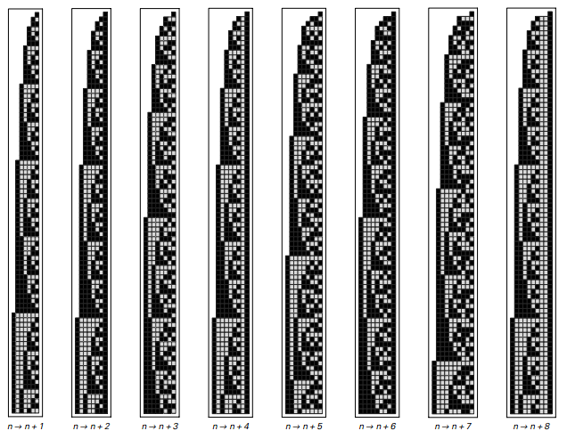
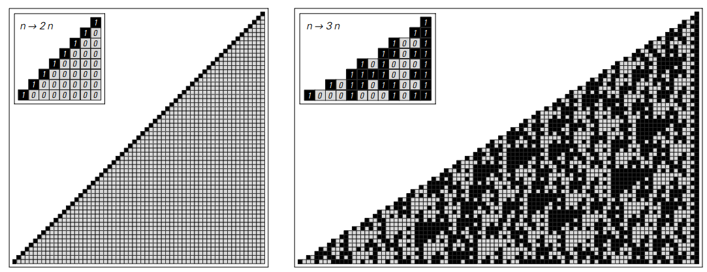
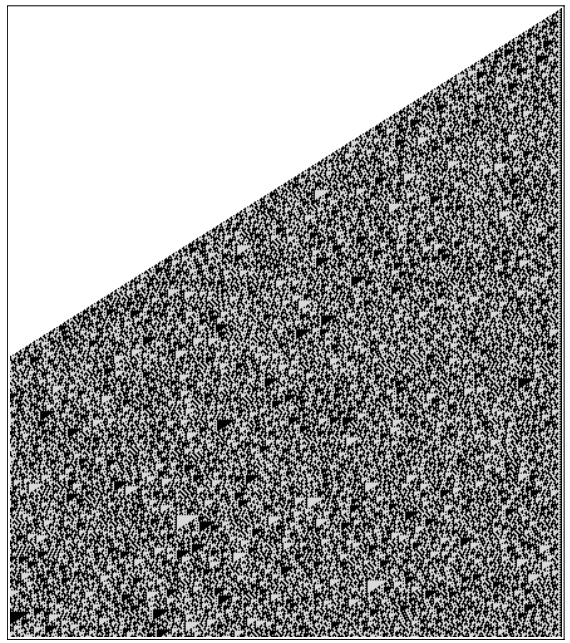
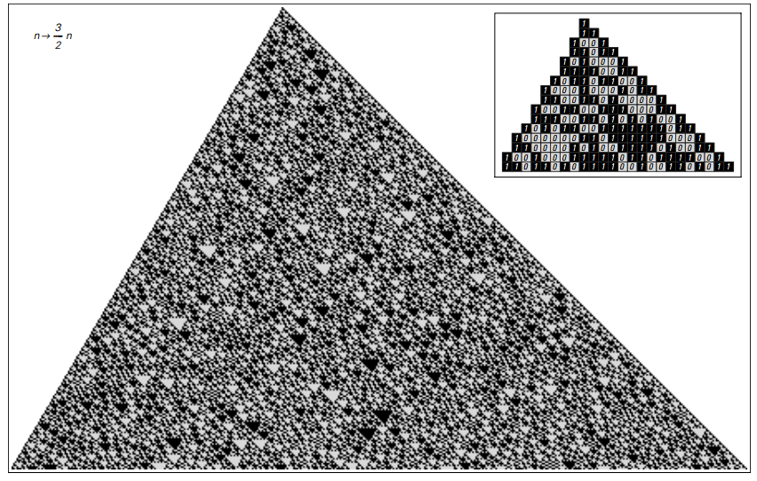
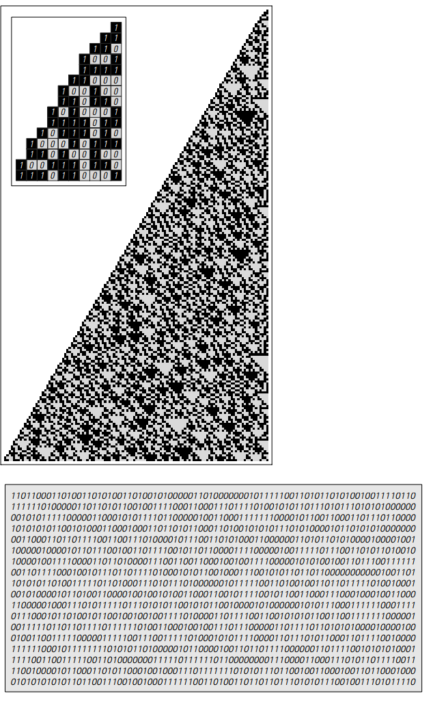
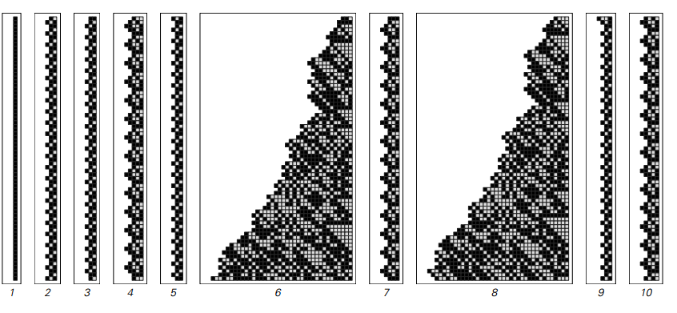
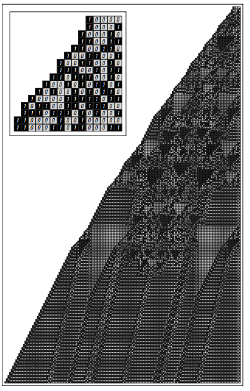
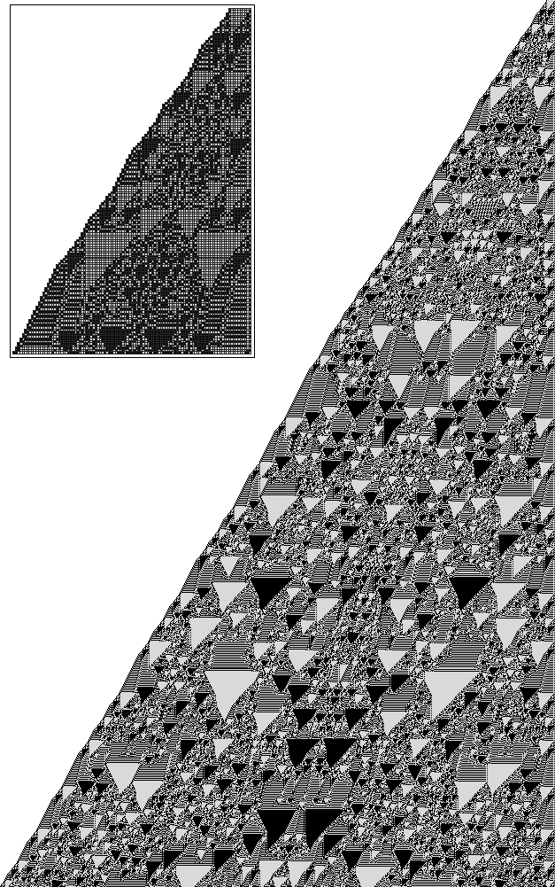
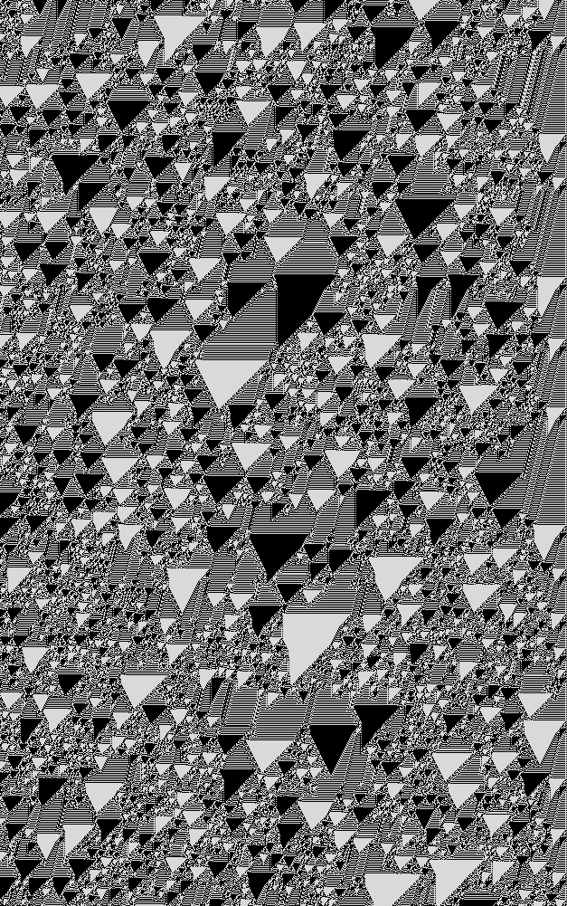

# 第四章 基于数字的系统

### 数字的概念

过去，许多科学最终都在试图找到用数字来描述自然系统的方法。

可在本书中，我几乎没有提到数字。然而，本章的目的是调查一系列基于数字的系统，将他们的行为与我们在其他系统中发现的行为相比较。

基于数字的系统在传统科学中如此受欢迎的主要原因在于，为处理这些数字而发展了大量的数学。事实上，有一些基于数字的系统，其行为几乎可以完全用微积分等数学方法进行分析。

当然不可避免的是，当这种完整的分析是可能的时候，最终的行为是相当简单的。

那么基于数字的系统实际上是否会产生复杂的行为呢？纵观科学和数学的绝大多数教科书，人们可能会得出结论，它们不能。但是，我们必须认识到，这些教科书中讨论的系统通常是专门选择适合于完全分析的系统，因此其行为必然非常简单。

事实上，正如我们在本章中将要看到的那样，如果忽略分析的需要，而只是看计算机实验的结果，那么很快就会发现，即使是基于数字的相当简单的系统也会导致高度复杂的行为。

（p115）

但是这种复杂性的起源是什么呢？这与我们在元胞自动机系统中看到的复杂性有什么关系？

有人可能会认为，用数学来研究系统的所有数学都可以很容易地回答这些问题。但事实上，传统的数学似乎导致了更多的困惑，而不是帮助。

一个基本的问题是，数字在传统数学中的处理方式与在计算机和计算机程序中处理的方式有很大不同。从某种意义上说，传统的数学是一个基本的理想化：它假定数字是基本的对象，其唯一的相关属性是它们的大小。但在计算机中，数字不是基本对象。相反，他们必须通过给出一个数字序列明确表示。

用数字表示数字的想法在日常生活中是很熟悉的：实际上，我们写数字的标准方式恰好与以10为基数的数字序列完全相同。基数10意味着每个数字有10个可能的选择：0到9，但正如页面底部的图片所示，可以同样使用其他基础。而在实际的计算机中，例如，基数2几乎总是被使用的。

数字3829在各个基底的表现。 最常见的情况是基数10，从右边连续的数字开始，对应于单位，数十，数百等等。 在基数10中，有10个可能的数字：0到9.在其他基数中，可能的数字有不同的数字。 在实际计算机中使用的基数2中，只有两个可能的数字：0和1.在这个基数中，从右边开始的连续数字具有系数1,2,4 = 2 * 2,8 = 2 * 2 * 2等.

（p116）

那么这意味着在计算机中，数字是由0和1的序列表示的，就像元胞自动机这样的系统中的白色和黑色元胞的序列。而数字操作则对应于更新0和1序列的方法。

在传统数学中，数字操作如何影响数字序列的细节通常被认为是无关紧要的。但是我们在本章中会发现，正是通过查看这些细节，我们才能更清楚地看到在基于数字的系统中复杂性如何发展。

在许多情况下，我们发现的行为看起来与前一章中看到的非常相似。事实上，最后，尽管传统数学提出了一些令人困惑的建议，但我们会发现，基于数字的系统的一般行为与我们已经讨论过的简单程序的一般行为非常相似。

### 基本算术

初等算术的操作是如此简单，以至于他们不可能导致任何复杂的行为。但是我们在这一部分会发现，事实上它们可以。

首先，考虑什么是最简单的可能的算术过程：从数字1开始，然后在逐步的每一步中逐渐加1。这个过程的结果是产生连续的数字1,2,3,4,5,6,7,8，这些数字的大小显然是一个非常简单的过程。

但是，如果一个人看起来不是这些整体大小，而是看起来是数字序列，那么所看到的就更加复杂了。事实上，正如下图所示，这些连续的数字序列（二进制形式——译者注）形成了一个显示错综复杂的嵌套结构的模式。

（p117）
下面的图片显示了如果在每一步添加1以外的数字会发生什么。 靠近右边缘的部分，每个图案都有所不同。 但总体而言，所有的模式具有完全相同的基本嵌套结构。

以1开始，然后在每个步骤中连续添加常数获得的数字的基数2中的数字序列。 所有这些模式最终都有相同的整体嵌套形式。

但是，如果不是加法运算使用乘法运算，那么得到的结果可能会非常不同。 下一页页顶部的第一张图片显示了如果从1开始，然后在每一步继续乘以2会发生什么。

事实证明，如果用数字表示数字作为基数为2的数字序列，则乘以2的操作具有非常简单的效果：它只是将数字序列向左移动一位，在右边添加一个0数字。 结果，连续乘以2得到的整体模式具有非常简单的形式。

（p118）

从数字1开始，然后依次乘以因子2和因子3产生的模式。在每种情况下，在每个步骤中获得的数字的数字序列以基数2示出。乘以2仅仅对应于将基数2中的所有数字向左移动一个位置，使得在这种情况下产生的总体模式非常简单。但乘以3会产生更复杂的模式，如上图所示。请注意，在这些图片中，在每个步骤中获得的完整数字分别对应于2和3的连续整数幂。

但是如果在每一步的倍增因子是3而不是2，那么获得的图案是相当不同的，正如第二张图片。事实上，尽管所使用的唯一操作只是简单的乘法运算，但在这种情况下获得的最终模式非常复杂。

下一页的图片显示了系统演进的更多步骤。在一个小规模的，有一些明显的三角形和其他结构，但超出这些模式看起来基本上是随机的。

就像在元胞自动机这样的简单程序中一样，基于数字的简单系统似乎也会产生非常复杂且显然是随机的行为。

但是我们可以想象，我们在下一页的图片中看到的复杂性必定是由于我们正在按照数字序列来查看数字的结果 —— 而且如果我们只是看着数字他们的整体规模的条款。

然而，一些例子会证明事实并非如此。

要开始第一个例子，考虑如果在每一步乘以1.5，会发生什么情况。从1开始，这样得到的连续数是1，3/2=1.5，9/4=2.25，27/8=3.375，81/16=5.0625，243/32=7.59375，729/64=11.390625，……

（p119）

3的500步平方，以2为基底显示。一些小规模的结构是可见的，但在更大规模的模式似乎是随机的所有实际目的。 请注意，这里显示的模式已被截断在左边的页面边缘，虽然实际上整个模式继续向左扩展，平均斜率Log [2,3]=1.58。

（p120）

下面的图片显示了这些数字的基数为2的数字序列。位于模式顶部的原始1的正下方和左侧的数字对应于每个连续数字的整数部分（例如3.375中的3 ），而位于右侧的数字对应于小数部分（例如3.375中的0.375）。

以2为基底对3/2的连续平方。3/2的乘法可以被认为是乘以3乘以除以2得到的除法。但是除以2只是乘以2的相反，所以在基数2中它简单地将所有数字向右移动一个位置。 整体模式因此是面向页面上显示的模式的移位版本。

不明确地查看完整的数字模式，而是可以考虑找到每个连续数字的小数部分的大小。 这些尺寸绘制在下一页的顶部。 图片也显示出它们在数字水平上也表现出那种复杂性和明显的随机性。

（p121）

3/2的连续幂的小数部分的大小。 这些大小是完全独立于什么基地是用来表示数字。 只有点是重要的; 它们之间的阴影和线条只是包含在内，以使绘图更易于阅读。

 刚刚给出的例子涉及具有小数部分的数字。 但事实证明，类似的现象也可以在只涉及整数的系统中找到。

作为第一个例子，考虑用上面乘以3/2的操作的细微变化：如果特定步骤中的数字是偶数（可以被2除尽），那么简单地乘以该数字，得到整数。 但是，如果数字是奇数，那么首先加1，以得到一个偶数，然后乘以3/2。

从数字1开始的结果，然后应用以下规则：如果特定步骤中的数字是偶数，则乘以3/2; 否则，加1，然后乘以3/2。 这个过程产生一连串的整数，其基数为2的数字序列显示在右边。 上面显示了在每个步骤中获得的最右边的数字。 数字为偶数时为0，奇数时为1，如图所示，数字以表面上随机的方式交替。 事实证明，这里所描述的系统与研究第100页上所示的注册机器时产生的系统密切相关。
这个系统可以用规则表示为：n->If[EvenQ[n],3n/2,3(n+1)/2]，100页的规则是n->If[EvenQ[n],3n/2,(3n+1)/2]。在第一步之后，这些系统给出相同的数字序列，除了整体因子3。

（p122）

此过程始终保证给出一个整数。从1开始，得到的数字的顺序是1,3,6,9,15,24,36,54,81,123,186,279,420,630,945,1419,2130,3195,4794， ...

其中一些数字是偶数，而有些则是奇数。但正如页面底部的结果所示，这些数字的顺序是偶数，奇数似乎是完全随机的。

然而，尽管有这种随机性，获得的数字的总体规模仍然相当规律的增长。但通过稍微改变程序，就可以得到更规律的增长。

作为一个例子，考虑以下程序：如果在特定步骤中获得的数字是偶数，则将该数字乘以5/2;否则，加1，然后乘以1/2。

如果从1开始，那么这个过程在每一步简单地给出1。确实有很多起始数字，程序产生纯粹的重复行为。但正如下图所示，它也可以给出更复杂的行为。

应用规则 n->If[EvenQ[n],5n/2,(n+1)/2]，从不同的初始n开始。许多案例中，是纯粹的重复行为。但在一些例子中不是的。

从数字6开始，在连续步骤中获得的数字的大小表现出普遍增加的趋势，但是存在相当大的波动，并且这些波动似乎本质上是随机的。事实上，即使经过一百万步后，获得的数字有48,554（10位数字），仍然没有重复的迹象或任何其他显着的规律性。

（p123）

结果遵循与前一页相同的规则，从数值6开始。在右边绘制的是第一千步获得的数字的整体大小。该图是以对数为单位的，所以每个点的高度本质上就是它所代表的数字的数字序列的长度，或左边的行的宽度。

所以，即使只考虑整数的整体大小，仍然有可能在基于数字的系统中变得非常复杂。

但是，虽然在这个层面上复杂性是显而易见的，但通常有必要进入更详细的层面，以便真正了解其发生的原因。事实上，我们在这一部分发现的是，如果我们看一下数字序列，那么就可以看到与像元胞自动机这样的系统产生的复杂模式非常相似的复杂模式。

然而像元胞自动机这样的系统的基本规则通常与基于数字的系统的规则不同。重点是元胞自动机的规则总是局部的：任何特定单元格的新颜色只取决于该单元格及其直接邻居的以前的颜色。但是在基于数字的系统中通常没有这样的地方。

从手上计算得知，即使像加法这样的操作也会导致任意向左传播的数字。事实上，最简单的算术运算具有这样的性质，即在其结果中的特定位置出现的数字可以取决于原来远离它的数字。

（p124）

但是，尽管基本规则中的基本差异如此，但基于数字的系统所产生的整体行为仍然非常类似于例如元胞自动机所看到的。 

因此，就像我们在前一章讨论的各种程序一样，基本规则的细节似乎也不会对可能发生的行为产生重要影响。 

事实上，尽管在其基本规则中缺少局部性，下面几页的图片显示，甚至有可能找到基于数字的系统，这些数字展示了我们在第32页的元胞自动机中看到的局部结构。

按照以下规则定义的系统示例：在每个步骤中，取得在该步骤中获得的编号，并以相反的顺序编写其基数2位数，然后将结果编号添加到原始编号中。 对于许多可能的起始号码，获得的行为是非常简单的。 这张照片显示了当人们从数字16开始时会发生什么事情。经过180步后，结果证明所有存活的东西都是一些可以看作是局部结构的物体。
（p125）

与前一页相同规则的系统进化的一千步，但是现在从512开始。本地化的结构是可见的，但总体模式似乎从来没有采取过任何一种简单的重复形式。
（p126）

从第一百万步开始，面向页面上的模式继续。 图片显示了图案的右边缘; 完整的图案延伸到左侧页面宽度的约700倍。

（p127）
