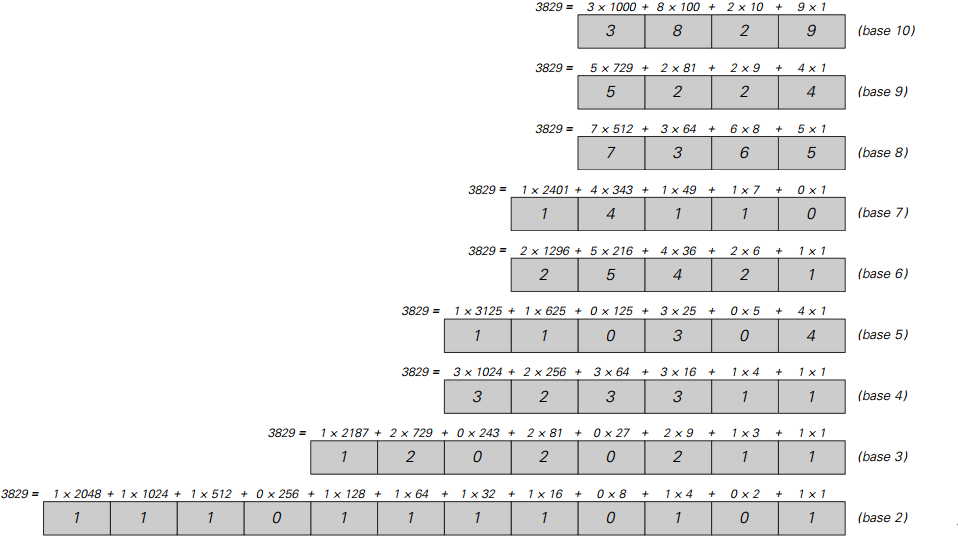

# 第四章 基于数字的系统

### 数字的概念

过去，许多科学最终都在试图找到用数字来描述自然系统的方法。

可在本书中，我几乎没有提到数字。然而，本章的目的是调查一系列基于数字的系统，将他们的行为与我们在其他系统中发现的行为相比较。

基于数字的系统在传统科学中如此受欢迎的主要原因在于，为处理这些数字而发展了大量的数学。事实上，有一些基于数字的系统，其行为几乎可以完全用微积分等数学方法进行分析。

当然不可避免的是，当这种完整的分析是可能的时候，最终的行为是相当简单的。

那么基于数字的系统实际上是否会产生复杂的行为呢？纵观科学和数学的绝大多数教科书，人们可能会得出结论，它们不能。但是，我们必须认识到，这些教科书中讨论的系统通常是专门选择适合于完全分析的系统，因此其行为必然非常简单。

事实上，正如我们在本章中将要看到的那样，如果忽略分析的需要，而只是看计算机实验的结果，那么很快就会发现，即使是基于数字的相当简单的系统也会导致高度复杂的行为。

（p115）

但是这种复杂性的起源是什么呢？这与我们在元胞自动机系统中看到的复杂性有什么关系？

有人可能会认为，用数学来研究系统的所有数学都可以很容易地回答这些问题。但事实上，传统的数学似乎导致了更多的困惑，而不是帮助。

一个基本的问题是，数字在传统数学中的处理方式与在计算机和计算机程序中处理的方式有很大不同。从某种意义上说，传统的数学是一个基本的理想化：它假定数字是基本的对象，其唯一的相关属性是它们的大小。但在计算机中，数字不是基本对象。相反，他们必须通过给出一个数字序列明确表示。

用数字表示数字的想法在日常生活中是很熟悉的：实际上，我们写数字的标准方式恰好与以10为基数的数字序列完全相同。基数10意味着每个数字有10个可能的选择：0到9，但正如页面底部的图片所示，可以同样使用其他基础。而在实际的计算机中，例如，基数2几乎总是被使用的。

数字3829在各个基底的表现。 最常见的情况是基数10，从右边连续的数字开始，对应于单位，数十，数百等等。 在基数10中，有10个可能的数字：0到9.在其他基数中，可能的数字有不同的数字。 在实际计算机中使用的基数2中，只有两个可能的数字：0和1.在这个基数中，从右边开始的连续数字具有系数1,2,4，= 2 * 2,8 = 2 * 2 * 2等

（p116）